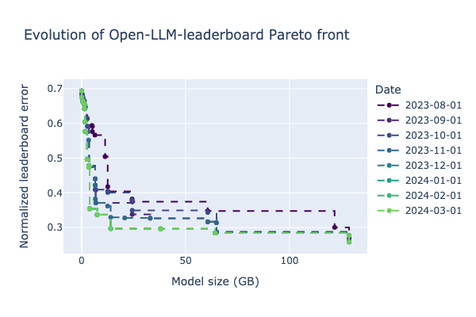

# Open LLM Leaderboard analysis

This is a notebook analysing models on HuggingFace Open LLM leaderboard from this blog post: [TODO](TODO).



## Installation

```bash
pip install -r requirements.txt
```

In addition, you will need pygmo if you want to compute pareto front. You can check the install instruction on [pygmo website](https://esa.github.io/pygmo2/install.html) for instance in conda:
```bash
conda install -c conda-forge pygmo
```
